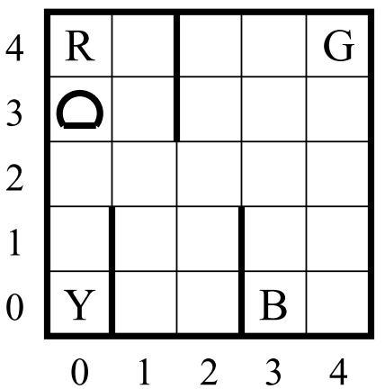
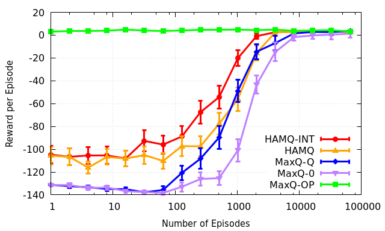

# Hierarchical online planning and reinforcement learning on Taxi

This release consists of codes for two projects:
- The MAXQ-based hierarchical **online planning** algorithm: MAXQ-OP
- The HAMQ-based hierarchical **reinforcement learning** algorithm: HAMQ-INT

Taxi domain:

Overall results:

Averaged over 200 runs.

# HAMQ-INT
The idea is to identify and take advantage of internal transitions within a HAM, which is represented as a partial program, for efficient hierarchical reinforcement learning. Details can be found in:
-   **Efficient Reinforcement Learning with Hierarchies of Machines by Leveraging Internal Transitions**, *Aijun Bai*, and Stuart Russell, *Proceedings of the Twenty-Fifth International Joint Conference on Artificial Intelligence (**IJCAI**), Melbourne, Australia, August 19 - 25, 2017.* \[[pdf](https://aijunbai.github.io/publications/IJCAI17-Bai.pdf)\]\[[bib](https://aijunbai.github.io/publications/IJCAI17-Bai.bib)\]

# MAXQ-OP
This is the code release of MAXQ-OP algorithm on the Taxi domain as described in papers:
- [Online planning for large Markov decision processes with hierarchical decomposition](https://aijunbai.github.io/publications/TIST15-Bai.pdf), Aijun Bai, Feng Wu, and Xiaoping Chen, ACM Transactions on Intelligent Systems and Technology (ACM TIST),6(4):45:1-45:28, July 2015.
- [Online Planning for Large MDPs with MAXQ Decomposition (Extended Abstract)](http://aijunbai.github.io/publications/AAMAS12-Bai.pdf), Aijun Bai, Feng Wu, and Xiaoping Chen, Proceedings of the 11th International Conference on Autonomous Agents and Multiagent Systems (AAMAS), Valencia, Spain, June 2012.

# Files
- `maxqop.{h, cpp}`: the MAXQ-OP algorithm
- `HierarchicalFSMAgent.{h, cpp}`: the HAMQ-INT algorithm
- `MaxQ0Agent.{h, cpp}`: the MAXQ-0 algorithm
- `MaxQQAgent.{h, cpp}`: the MAXQ-Q algorithm
- `agent.h`: abstract `Agent` class
- `state.{h, cpp}`: abstract `State` class
- `policy.{h, cpp}`: `Policy` classes
- `taxi.{h, cpp}`: the Taxi domain
- `system.{h, cpp}`: agent-environment driver code
- `table.h`: tabular V/Q functions
- `dot_graph.{h, cpp}`: tools to generate graphviz `dot` files

# Dependencies
- libboost-dev 
- libboost-program-options-dev
- gnuplot

